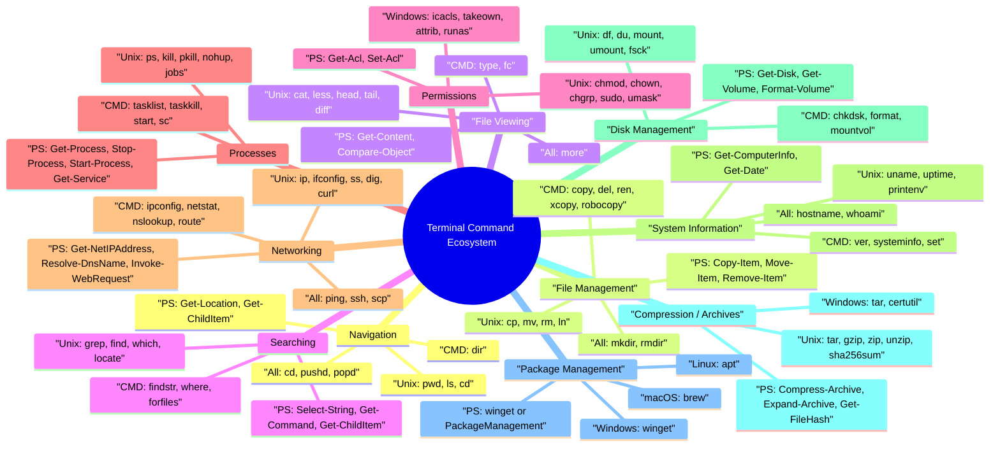

# Terminal Command Ecosystem

Comprehensive cross-platform command reference for Linux, macOS, Windows CMD, and Windows PowerShell.

This document is designed to work as:

- a mind map source
- a command lookup system
- a Markdown knowledge base
- a foundation for Mermaid, Excalidraw, or draw.io diagrams

## Root Node

`Terminal Command Ecosystem`

## Quick Finder

Use your editor or GitHub search to search by task phrases such as `copy file`, `kill process`, `find text`, `zip`, or `disk usage`.

Jump by function:

- [Navigation](#navigation)
- [File Management](#file-management)
- [File Viewing](#file-viewing)
- [Searching](#searching)
- [Permissions](#permissions)
- [Processes](#processes)
- [Networking](#networking)
- [System Information](#system-information)
- [Disk Management](#disk-management)
- [Compression / Archives](#compression--archives)
- [Package Management](#package-management)

## Overlap Legend

- `Unix` = shared by Linux and macOS
- `All` = available across Linux, macOS, Windows CMD, and PowerShell
- `CMD` = primarily Windows Command Prompt
- `PS` = PowerShell-focused
- `Near` = closest equivalent rather than a perfect one-to-one match

## Mind Map Seed



## Overlap Summary

### Shared by Linux and macOS

`pwd`, `ls`, `cd`, `cp`, `mv`, `rm`, `mkdir`, `rmdir`, `cat`, `less`, `head`, `tail`, `grep`, `find`, `chmod`, `chown`, `ps`, `kill`, `ping`, `ssh`, `scp`, `hostname`, `tar`, `df`, `du`

### Shared by All Platforms

`cd`, `mkdir`, `rmdir`, `pushd`, `popd`, `more`, `sort`, `echo`, `hostname`, `ping`, `tar` (modern Windows), `ssh` and `scp` (modern Windows/OpenSSH)

### Windows-Specific Commands

`dir`, `copy`, `xcopy`, `robocopy`, `del`, `ren`, `type`, `findstr`, `where`, `tasklist`, `taskkill`, `ipconfig`, `systeminfo`, `chkdsk`, `format`, `icacls`, `takeown`, `winget`

### Common PowerShell Equivalents

`Get-Location`, `Get-ChildItem`, `Copy-Item`, `Move-Item`, `Remove-Item`, `Get-Content`, `Select-String`, `Get-Process`, `Stop-Process`, `Start-Process`, `Get-Service`, `Get-NetIPAddress`, `Get-ComputerInfo`, `Get-Disk`, `Compress-Archive`

## Navigation

| Task | Linux | macOS | Windows CMD | PowerShell | Overlap |
|---|---|---|---|---|---|
| Print working directory | `pwd` | `pwd` | `cd` | `Get-Location` or `pwd` | Unix, Near |
| List directory contents | `ls` | `ls` | `dir` | `Get-ChildItem` or `ls` | Unix, PS |
| Change directory | `cd /path` | `cd /path` | `cd C:\path` | `Set-Location C:\path` or `cd` | All |
| Go to home directory | `cd ~` | `cd ~` | `cd %USERPROFILE%` | `cd ~` | Near |
| Create a directory stack entry and move | `pushd /path` | `pushd /path` | `pushd C:\path` | `Push-Location C:\path` or `pushd` | All |
| Return to previous stacked directory | `popd` | `popd` | `popd` | `Pop-Location` or `popd` | All |
| List directories recursively | `ls -R` | `ls -R` | `dir /s` | `Get-ChildItem -Recurse` | Near |
| Show current path as absolute physical path | `pwd -P` | `pwd -P` | `cd` | `(Get-Location).Path` | Unix, Near |

## File Management

| Task | Linux | macOS | Windows CMD | PowerShell | Overlap |
|---|---|---|---|---|---|
| Copy a file | `cp file1 file2` | `cp file1 file2` | `copy file1 file2` | `Copy-Item file1 file2` | Unix, CMD, PS |
| Copy a directory recursively | `cp -r src dst` | `cp -R src dst` | `xcopy src dst /e /i` or `robocopy src dst /e` | `Copy-Item src dst -Recurse` | Near |
| Move or rename a file | `mv old new` | `mv old new` | `move old new` or `ren old new` | `Move-Item old new` | Unix, Near |
| Delete a file | `rm file` | `rm file` | `del file` | `Remove-Item file` | Unix, Near |
| Delete a directory recursively | `rm -rf dir` | `rm -rf dir` | `rmdir /s /q dir` | `Remove-Item dir -Recurse -Force` | Near |
| Create an empty file | `touch file` | `touch file` | `type nul > file` | `New-Item file -ItemType File` | Unix, Near |
| Create a directory | `mkdir dir` | `mkdir dir` | `mkdir dir` | `New-Item dir -ItemType Directory` or `mkdir` | All |
| Create a symbolic link | `ln -s target link` | `ln -s target link` | `mklink link target` | `New-Item link -ItemType SymbolicLink -Target target` | Unix, CMD, PS |

## File Viewing

| Task | Linux | macOS | Windows CMD | PowerShell | Overlap |
|---|---|---|---|---|---|
| Print a file to the terminal | `cat file` | `cat file` | `type file` | `Get-Content file` or `cat` | Unix, Near |
| View a file page by page | `less file` | `less file` | `more file` | `Get-Content file \| more` | Near |
| Show first 10 lines | `head file` | `head file` | `more +1 file` | `Get-Content file -TotalCount 10` | Unix, Near |
| Show last 10 lines | `tail file` | `tail file` | `powershell -Command "Get-Content file -Tail 10"` | `Get-Content file -Tail 10` | PS, Near |
| Follow a growing log file | `tail -f app.log` | `tail -f app.log` | `powershell -Command "Get-Content app.log -Wait"` | `Get-Content app.log -Wait` | PS, Near |
| Count lines, words, and bytes | `wc file` | `wc file` | `find /v /c "" file` | `Get-Content file \| Measure-Object -Line -Word -Character` | Unix, Near |
| Detect file type | `file name.bin` | `file name.bin` | `assoc` and `ftype` | `Get-Item name.bin \| Format-List Name,Length,Extension` | Unix, Near |
| Compare two text files | `diff a b` | `diff a b` | `fc a b` | `Compare-Object (Get-Content a) (Get-Content b)` | Near |

## Searching

| Task | Linux | macOS | Windows CMD | PowerShell | Overlap |
|---|---|---|---|---|---|
| Search for text recursively in files | `grep -R "text" .` | `grep -R "text" .` | `findstr /s /n /i "text" *` | `Select-String -Path .\* -Pattern "text" -Recurse` | Unix, Near |
| Find files by name | `find . -name "*.log"` | `find . -name "*.log"` | `dir /s /b *.log` | `Get-ChildItem -Recurse -Filter *.log` | Unix, Near |
| Locate an executable in `PATH` | `which git` | `which git` | `where git` | `Get-Command git` | Unix, Near |
| Filter command output for matching text | `command \| grep text` | `command \| grep text` | `command \| findstr text` | `command \| Select-String text` | Near |
| Count matching lines | `grep -c "error" app.log` | `grep -c "error" app.log` | `find /c "error" app.log` | `(Select-String -Pattern "error" app.log).Count` | Unix, Near |
| Find recently modified files | `find . -mtime -1` | `find . -mtime -1` | `forfiles /d +0 /c "cmd /c echo @path"` | `Get-ChildItem -Recurse \| Where-Object {$_.LastWriteTime -gt (Get-Date).AddDays(-1)}` | Near |
| Indexed filename search | `locate ssh_config` | `mdfind ssh_config` | `where /r C:\ ssh_config` | `Get-ChildItem C:\ -Recurse -ErrorAction SilentlyContinue \| Where-Object Name -like "*ssh_config*"` | Near |
| Search command help by keyword | `apropos archive` | `apropos archive` | `help \| findstr archive` | `Get-Command *archive*` | Unix, Near |

## Permissions

| Task | Linux | macOS | Windows CMD | PowerShell | Overlap |
|---|---|---|---|---|---|
| View file permissions or ACLs | `ls -l file` | `ls -l file` | `icacls file` | `Get-Acl file` | Unix, Windows |
| Change mode bits | `chmod 755 script.sh` | `chmod 755 script.sh` | `icacls script.bat /grant %USERNAME%:RX` | `icacls script.bat /grant "$env:USERNAME`:RX"` | Near |
| Make a script executable | `chmod +x script.sh` | `chmod +x script.sh` | `assoc` and `ftype` | `Set-ExecutionPolicy RemoteSigned -Scope CurrentUser` | Near |
| Change file owner | `chown user file` | `chown user file` | `takeown /f file` | `takeown /f file` | Unix, Windows |
| Change file group | `chgrp devs file` | `chgrp staff file` | `icacls file /grant Users:R` | `icacls file /grant Users:R` | Near |
| Run a command with elevated privileges | `sudo command` | `sudo command` | `runas /user:Administrator command` | `Start-Process powershell -Verb RunAs` | Near |
| Set default file creation mask | `umask 022` | `umask 022` | `attrib +r file` | `Set-ItemProperty file -Name IsReadOnly -Value $true` | Near |
| Show current identity and groups | `id` | `id` | `whoami /groups` | `whoami /groups` | Near |

## Processes

| Task | Linux | macOS | Windows CMD | PowerShell | Overlap |
|---|---|---|---|---|---|
| List running processes | `ps aux` | `ps aux` | `tasklist` | `Get-Process` or `ps` | Unix, Windows |
| Find a process by name | `ps aux \| grep nginx` | `ps aux \| grep nginx` | `tasklist \| findstr nginx` | `Get-Process nginx` | Near |
| Kill a process by PID | `kill 1234` | `kill 1234` | `taskkill /PID 1234 /F` | `Stop-Process -Id 1234 -Force` | Unix, Near |
| Kill a process by name | `pkill nginx` | `pkill nginx` | `taskkill /IM nginx.exe /F` | `Stop-Process -Name nginx -Force` | Unix, Near |
| Start a process detached or in background | `nohup cmd &` | `nohup cmd &` | `start /b cmd` | `Start-Process cmd` | Near |
| Show process tree | `pstree -p` | `ps -axjf` | `wmic process get Name,ParentProcessId,ProcessId` | `Get-CimInstance Win32_Process \| Select-Object Name,ParentProcessId,ProcessId` | Near |
| Work with shell jobs | `jobs`, `bg`, `fg` | `jobs`, `bg`, `fg` | `start /b` | `Start-Job`, `Get-Job`, `Receive-Job` | Near |
| Query services | `systemctl status sshd` | `launchctl list` | `sc query` | `Get-Service` | Near |

## Networking

| Task | Linux | macOS | Windows CMD | PowerShell | Overlap |
|---|---|---|---|---|---|
| Show IP configuration | `ip addr` | `ifconfig` | `ipconfig` | `Get-NetIPAddress` | Near |
| Test connectivity to a host | `ping host` | `ping host` | `ping host` | `ping host` or `Test-Connection host` | All |
| Perform a DNS lookup | `dig example.com` | `dig example.com` | `nslookup example.com` | `Resolve-DnsName example.com` | Near |
| Show the routing table | `ip route` | `netstat -rn` | `route print` | `Get-NetRoute` | Near |
| List open connections and listening ports | `ss -tulpn` | `lsof -i -P -n` | `netstat -ano` | `Get-NetTCPConnection` | Near |
| Make an HTTP request | `curl -I https://example.com` | `curl -I https://example.com` | `curl -I https://example.com` | `Invoke-WebRequest https://example.com -Method Head` | Unix, All, PS |
| Open an SSH session | `ssh user@host` | `ssh user@host` | `ssh user@host` | `ssh user@host` | All, Near |
| Copy files over SSH | `scp file user@host:/path` | `scp file user@host:/path` | `scp file user@host:/path` | `scp file user@host:/path` | All, Near |

## System Information

| Task | Linux | macOS | Windows CMD | PowerShell | Overlap |
|---|---|---|---|---|---|
| Show hostname | `hostname` | `hostname` | `hostname` | `hostname` | All |
| Show OS version | `uname -a` | `sw_vers` | `ver` | `Get-ComputerInfo \| Select-Object OsName,OsVersion` | Near |
| Show current user | `whoami` | `whoami` | `whoami` | `whoami` | All |
| List environment variables | `printenv` | `printenv` | `set` | `Get-ChildItem Env:` | Near |
| Show date and time | `date` | `date` | `echo %DATE% %TIME%` | `Get-Date` | Near |
| Show uptime or last boot | `uptime` | `uptime` | `systeminfo \| find "Boot Time"` | `Get-CimInstance Win32_OperatingSystem \| Select-Object LastBootUpTime` | Near |
| Show CPU information | `lscpu` | `sysctl -n machdep.cpu.brand_string` | `wmic cpu get name` | `Get-CimInstance Win32_Processor \| Select-Object Name,NumberOfCores` | Near |
| Show memory information | `free -h` | `vm_stat` | `systeminfo \| findstr /c:"Total Physical Memory" /c:"Available Physical Memory"` | `Get-CimInstance Win32_OperatingSystem \| Select-Object TotalVisibleMemorySize,FreePhysicalMemory` | Near |

## Disk Management

| Task | Linux | macOS | Windows CMD | PowerShell | Overlap |
|---|---|---|---|---|---|
| Show filesystem usage | `df -h` | `df -h` | `wmic logicaldisk get caption,freespace,size` | `Get-PSDrive -PSProvider FileSystem` | Unix, Near |
| Show directory size | `du -sh dir` | `du -sh dir` | `dir dir /s` | `Get-ChildItem dir -Recurse \| Measure-Object Length -Sum` | Unix, Near |
| List disks and partitions | `lsblk` | `diskutil list` | `wmic diskdrive list brief` | `Get-Disk` | Near |
| Show mounted filesystems or volumes | `mount` | `mount` | `mountvol` | `Get-Volume` | Unix, Near |
| Check a filesystem or volume | `fsck /dev/sdX1` | `diskutil verifyVolume /` | `chkdsk C:` | `Repair-Volume -DriveLetter C -Scan` | Near |
| Mount a volume or disk image | `mount /dev/sdX1 /mnt` | `diskutil mount disk2s1` | `mountvol X: \\?\Volume{GUID}\` | `Mount-DiskImage file.iso` | Near |
| Unmount a volume or disk image | `umount /mnt` | `diskutil unmount disk2s1` | `mountvol X: /D` | `Dismount-DiskImage file.iso` | Near |
| Format a volume | `mkfs.ext4 /dev/sdX1` | `diskutil eraseDisk APFS NAME /dev/disk2` | `format X:` | `Format-Volume -DriveLetter X` | Near |

## Compression / Archives

| Task | Linux | macOS | Windows CMD | PowerShell | Overlap |
|---|---|---|---|---|---|
| Create a `.tar` archive | `tar -cf archive.tar dir` | `tar -cf archive.tar dir` | `tar -cf archive.tar dir` | `tar -cf archive.tar dir` | All, Near |
| Extract a `.tar` archive | `tar -xf archive.tar` | `tar -xf archive.tar` | `tar -xf archive.tar` | `tar -xf archive.tar` | All, Near |
| Create a `.tar.gz` archive | `tar -czf archive.tar.gz dir` | `tar -czf archive.tar.gz dir` | `tar -czf archive.tar.gz dir` | `tar -czf archive.tar.gz dir` | All, Near |
| Extract a `.tar.gz` archive | `tar -xzf archive.tar.gz` | `tar -xzf archive.tar.gz` | `tar -xzf archive.tar.gz` | `tar -xzf archive.tar.gz` | All, Near |
| Create a `.zip` archive | `zip -r archive.zip dir` | `zip -r archive.zip dir` | `tar -a -c -f archive.zip dir` | `Compress-Archive -Path dir -DestinationPath archive.zip` | Near |
| Extract a `.zip` archive | `unzip archive.zip` | `unzip archive.zip` | `tar -xf archive.zip` | `Expand-Archive archive.zip .` | Near |
| List archive contents | `tar -tf archive.tar` or `unzip -l archive.zip` | `tar -tf archive.tar` or `unzip -l archive.zip` | `tar -tf archive.tar` | `tar -tf archive.tar` or `Get-ChildItem archive.zip` | Near |
| Compute a SHA-256 checksum | `sha256sum file` | `shasum -a 256 file` | `certutil -hashfile file SHA256` | `Get-FileHash file -Algorithm SHA256` | Near |

## Package Management

Linux examples use `apt`; replace with your distro's package manager if needed.

| Task | Linux | macOS | Windows CMD | PowerShell | Overlap |
|---|---|---|---|---|---|
| Search for a package | `apt search nginx` | `brew search nginx` | `winget search nginx` | `winget search nginx` | Near |
| Install a package | `sudo apt install nginx` | `brew install nginx` | `winget install nginx` | `winget install nginx` | Near |
| Remove a package | `sudo apt remove nginx` | `brew uninstall nginx` | `winget uninstall nginx` | `winget uninstall nginx` | Near |
| Refresh package sources | `sudo apt update` | `brew update` | `winget source update` | `winget source update` | Near |
| Upgrade installed packages | `sudo apt upgrade` | `brew upgrade` | `winget upgrade --all` | `winget upgrade --all` | Near |
| List installed packages | `apt list --installed` | `brew list` | `winget list` | `winget list` | Near |
| Show package details | `apt show nginx` | `brew info nginx` | `winget show nginx` | `winget show nginx` | Near |
| Pin or hold a package version | `sudo apt-mark hold nginx` | `brew pin nginx` | `winget pin add nginx` | `winget pin add nginx` | Near |

## Suggested GitHub Browsing Pattern

If this grows into a larger repository, split by function:

```text
docs/
├── 01-navigation.md
├── 02-file-management.md
├── 03-file-viewing.md
├── 04-searching.md
├── 05-permissions.md
├── 06-processes.md
├── 07-networking.md
├── 08-system-information.md
├── 09-disk-management.md
├── 10-compression-archives.md
└── 11-package-management.md
```

That structure preserves:

- fast GitHub browsing by function
- easy text search by task
- straightforward import into diagramming tools
- simple maintenance as command coverage expands
